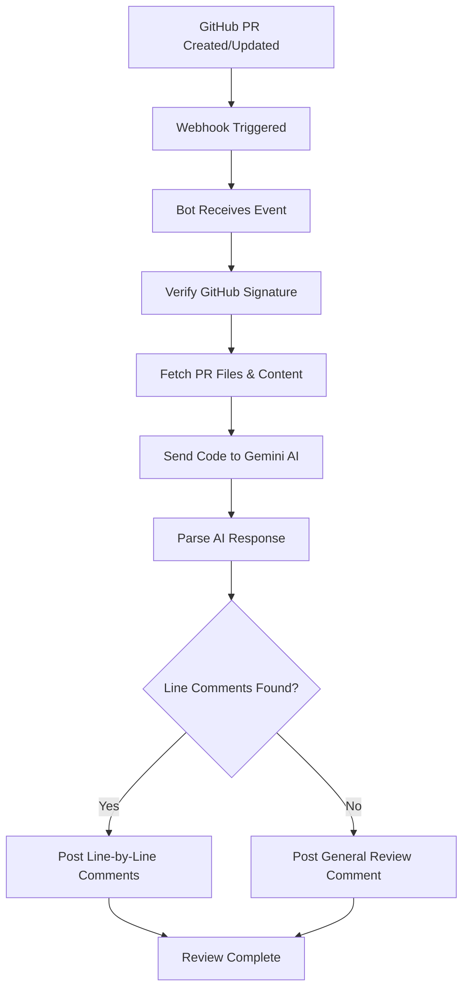

# GitHub PR Bot 🤖

An intelligent GitHub Pull Request reviewer that automatically analyzes code changes and provides detailed feedback using AI.

## 🚀 Features

- **Automatic PR Review**: Reviews every pull request automatically
- **Line-by-Line Comments**: Posts specific comments on problematic lines
- **AI-Powered Analysis**: Uses Google Gemini AI for intelligent code review
- **Security Scanning**: Detects hardcoded secrets, security vulnerabilities
- **Bug Detection**: Identifies potential bugs and performance issues
- **Best Practices**: Suggests code improvements and best practices

## 🛠 Tech Stack

- **Runtime**: Cloudflare Workers (Serverless)
- **Framework**: Hono.js (Lightweight web framework)
- **Language**: TypeScript
- **AI**: Google Gemini 2.0 Flash API
- **APIs**: GitHub REST API
- **Deployment**: Wrangler CLI

## 📋 How It Works



## 🔧 Setup

1. **Clone Repository**

   ```bash
   git clone <your-repo>
   cd github-pr-bot/github-bot
   ```

2. **Install Dependencies**

   ```bash
   npm install
   ```

3. **Configure Environment**

   - Update `wrangler.jsonc` with your tokens:
     - `GITHUB_SECRET`: Webhook secret
     - `GITHUB_TOKEN`: GitHub Personal Access Token
     - `GEMINI_API_KEY`: Google Gemini API key

4. **Deploy**

   ```bash
   npm run deploy
   ```

5. **Setup GitHub Webhook**
   - URL: `https://your-bot.workers.dev/webhook`
   - Events: `Pull requests`
   - Content type: `application/json`

## 🔑 Required Permissions

**GitHub Token Permissions:**

- `Contents: Read`
- `Pull requests: Read & Write`
- `Issues: Write`

## 📝 Example Output

The bot provides detailed feedback like:

```
Line 1: Security issue: API_KEY is hardcoded.
Move to environment variables using process.env.API_KEY

Line 6: Bug: Missing null check for user object.
Add: if (!user) return null;

Line 15: Performance: O(n²) complexity detected.
Use users.find() for O(n) complexity
```

## 🎯 Supported Issues

- **Security**: Hardcoded secrets, SQL injection risks
- **Bugs**: Null pointer exceptions, undefined variables
- **Performance**: Inefficient algorithms, memory leaks
- **Best Practices**: Code style, naming conventions
- **Syntax**: Typos, syntax errors

## 📊 Architecture

- **Serverless**: Runs on Cloudflare Workers
- **Event-Driven**: Triggered by GitHub webhooks
- **Stateless**: No database required
- **Scalable**: Auto-scales with traffic

## 🔍 Monitoring

View real-time logs:

```bash
wrangler tail github-bot
```

## 📈 Performance

- **Response Time**: < 5 seconds per PR
- **Token Usage**: ~1000 tokens per review
- **Cost**: ~$0.001 per review (Gemini pricing)

## 🚀 Live Demo

[View Live Bot](https://github-bot.bkumar-be23.workers.dev)

---

_Built with ❤️ using Cloudflare Workers and Google Gemini AI_
